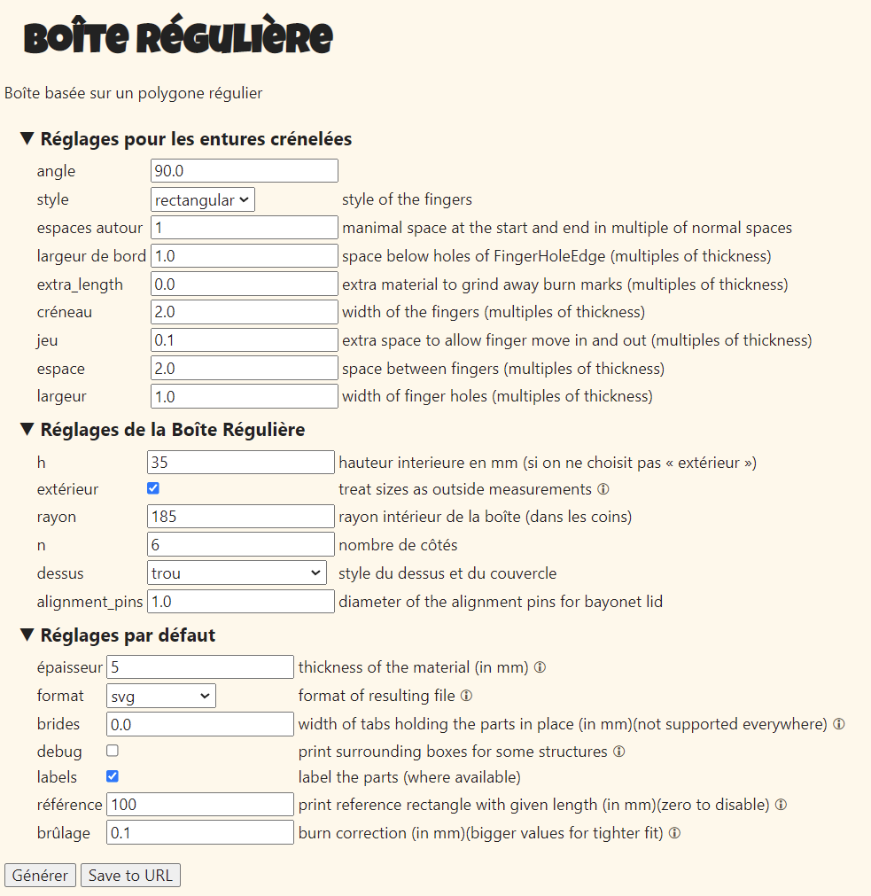

## Plan de construction ##
Dans ce répertoire, se trouve tout ce qui concerne la construction physique.

## Génération de la boite ##
Paramètres pour la génération de la boite octogonale sur le site https://www.festi.info/boxes.py/RegularBox?language=fr

Hauteur des boites : 
* 80mm pour le fond (Boite_Fond-5mm.svg)
* 35mm pour la partie électronique (Boite_PartieElectronique-5mm.svg)

## Epaisseurs des matériaux ##
* PMMA :
  * Arceaux: 10 mm (car c’est la largeur du ruban de LED)
* CTP peuplier :
  * Dessus de la base: 10 mm 
  * Coté de la base: 5 mm
  * Dessous de la base 5mm
  * Assiette 3 épaisseurs de 5 mm (Epaisseur du fil et des ILS)
  * Plat : 5 mm

## Paramétres des découpes laser ##
Ces paramètres sont valmable pour la laser avec des miroirs propres.

| Matériau | Opération | Power | Speed | Remarque |
|----------|-----------|------|-------|----------|
| PMMA 10 mm | Cut | 100 | 5 |  |
| PMMA 10 mm | Mark | 30 | 60 |  |
| MDF 3 mm | Cut | 100 | 40 | |
| MDF 3 mm | Mark | 8 | 20 | |
| CTP Peuplier 5 mm | Cut | 100 | 45 | |
| CTP Peuplier 5 mm | Mark | 8 | 20 | |
| CTP Peuplier 10 mm | Cut | 100 | 8 | Généralement ça coupe en 1 passage|
| CTP Peuplier 10 mm | Mark | 8 | 20 | |
